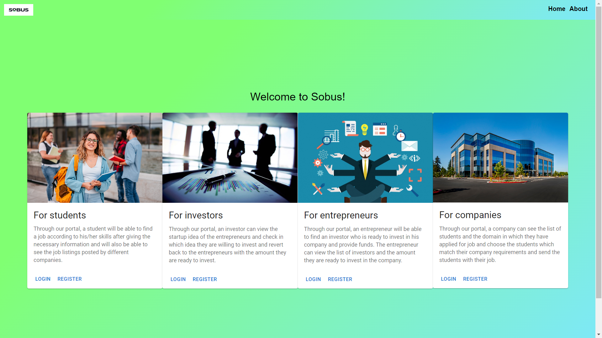

# About

This web app was built by the team I was a part of to help Sobus ingest huge amounts of data and analyze it.
The project was built using Django Rest Framework on the backend with Sqlite3 as the database and React.js on the frontend.
This web app aims to provide a user friendly interface for skilled job seekers and entrepeneurs to connect with equipped investors and companies.

To run this project (in the root directory of the project):\
Backend:

```
virtualenv env
env\Scripts\activate
cd cfg-server
pip install -r requirements.txt
python manage.py makemigrations
python manage.py migrate
python manage.py runserver
```

Frontend:

```
cd client
yarn install
yarn build
serve -s build
```
